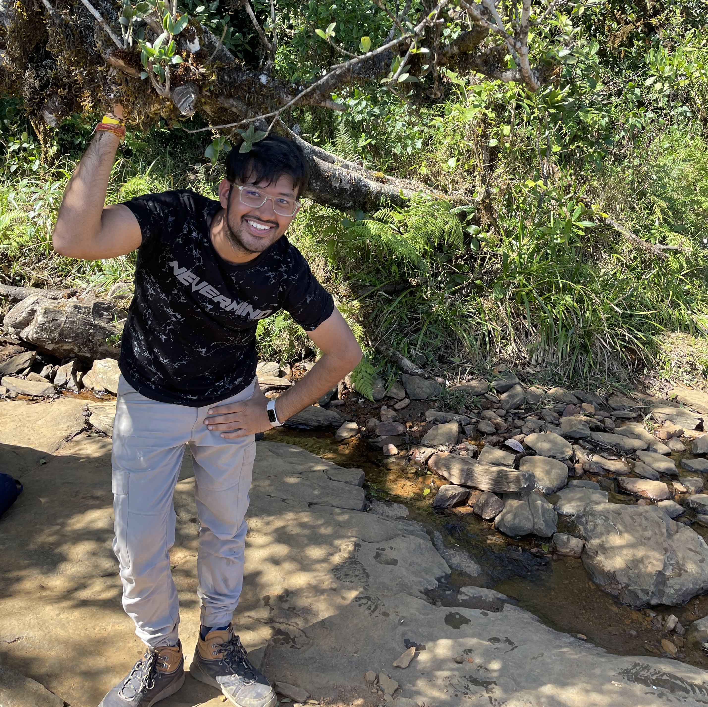

True intelligence is the ability to adapt to the unknown, a challenge AI has faced since its inception. I want to push AI beyond pattern recognition toward compositional reasoning which involves identifying core abstractions and combining them to make sense even in new contexts. This concept aligns with advancements in understanding of intelligence, as discussed in works like “On the Measure of Intelligence” [(François Chollet, 2019)](https://arxiv.org/abs/1911.01547) and "Generalization without systematicity" [(Lake and Baroni, 2019)](https://arxiv.org/abs/1711.00350). 

I’m researching systems that can achieve disentangled representations of intelligence, enabling AI to break down complex information into core components for better reasoning and adaptability. I love exploring how multimodal representations—such as text, images, and sensor data—interact to form a unified and interpretable understanding of the world.

Currently, I’m developing methods that combine compositional understanding with strong statistical modeling to tackle critical challenges. In cybersecurity, I focus on adaptive threat detection and recognition, improving the ability to identify rare and evolving attacks. In medical imaging, my work addresses rare disease detection, where identifying subtle patterns can make a significant difference in diagnosis and treatment. Additionally, I’m advancing methods for detailed object recognition in 3D scenes, enabling AI to interpret complex environments with precision.

I have been fortunate to collaborate with leading experts across diverse fields, including [Prof. Mohamed H. Elhoseiny](http://www.mohamed-elhoseiny.com/) (3D Vision, Creative Computing, Continual Learning, NLP), [Prof. Peter Wonka](https://peterwonka.net/) (Computer Graphics, 3D Vision), [Dr. Aakanksha Chowdhery](https://www.achowdhery.com/) (Efficient AI, Large Language Models, Edge Computing), [Dr. Jason Tarpley](https://www.pacificneuroscienceinstitute.org/people/jason-tarpley/) (Neuroscience, Surgery), [Dr. Jeyaraj Pandian](https://www.linkedin.com/in/jeyaraj-pandian-5a207b1b6?originalSubdomain=in) (Neuroscience, Surgery). Their insights and expertise have greatly enriched my research and broadened my perspective on building impactful AI systems.
