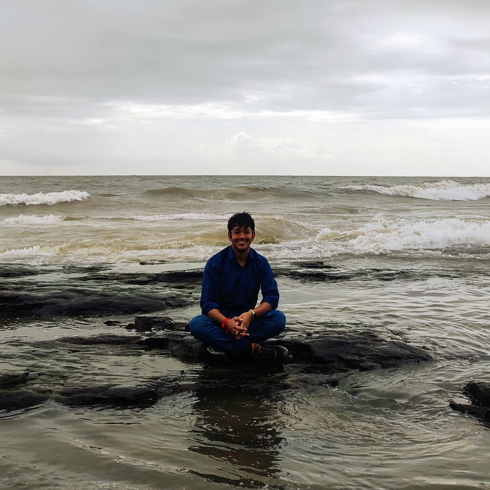

I’m a researcher exploring domains of Artificial Intelligence. My research interests include computer vision, adversarial machine learning, and representation learning. My primary focus is to build systems that offer true disentangled abstraction of human intelligence. Recently, I have been involved in cutting-edge research in 3D vision, Scene understanding, and Neuroscience.

I have worked on diverse areas of AI ranging from 3D vision, keyword spotting, multimodal and multitask learning to object detection and segmentation.

Currently, I’m working as AI scientist at [qure.ai](https://qure.ai) where we are applying novel deep learning on medical data. The goal is to make healthcare affordable and effective.

I have collaborated with top researcher in their field like [Prof. Mohamed H. Elhoseiny](http://www.mohamed-elhoseiny.com/) (3D Vision, Creative Computing, Continual Learning, NLP), [Prof. Peter Wonka](https://peterwonka.net/) (Computer Graphics, 3D Vision), [Dr. Aakanksha Chowdhery](https://achowdhery.github.io/achowdhery-website/index.html) (Efficient AI, Large Models, Edge Computing), [Dr. Jason Tarpley](https://www.pacificneuroscienceinstitute.org/people/jason-tarpley/) (Neuroscience, Surgery), [Dr. Jeyaraj Pandian](https://www.linkedin.com/in/jeyaraj-pandian-5a207b1b6?originalSubdomain=in) (Neuroscience, Surgery).

<!-- I'm a research scientist at the University of Illinois Urbana-Champaign's [Institute for Sustainability, Energy, and Environment](https://sustainability.illinois.edu/).

My recent [research]({{site.baseurl}}/research.html) is primarily in soil carbon, water quality, and childhood lead poisoning. My methodological interests include Bayesian multilevel and spatiotemporal modeling, causal inference, targeted interventions, and experimental design.

I was previously at the University of Chicago's [Harris School of Public Policy](http://harris.uchicago.edu) and [Center for Data Science and Public Policy](http://dsapp.uchicago.edu). Before that, I studied mathematics at Northwestern where my [dissertation]({{site.baseurl}}/assets/pdf/dissertation.pdf) was in the field of geometric analysis. -->
